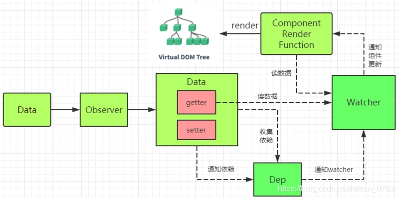

> 此项目主要是理清 Observer，Watcher，Dep三个类的关系和用途




### Observer类
 - 把js的对象深度的转为用getter/setter定义的数据对象
### Dep类
 - 每一个observe实例都有一个dep实例，用来存储依赖此数据的watche
 - 是收集依赖和通知依赖更新的作用
 - 用到此数据的地方就要依赖此数据，所以在getter中收集依赖
 - 当数据更新时，我要在setter中通知依赖我数据的地方更新
### Watcher类
 - 是一个监听者的角色，也是Dep中要收集的依赖者
 - 当使用new Watcher监听一个数据时，也就会被Dep收集
 - 数据变化时，Dep会通知watch更新

 数据解构如下
 ```
 {
   __ob__: Observer{
     dep: Dep{
       subs: [Watcher, Watcher]
     }
   }
 }
 ```